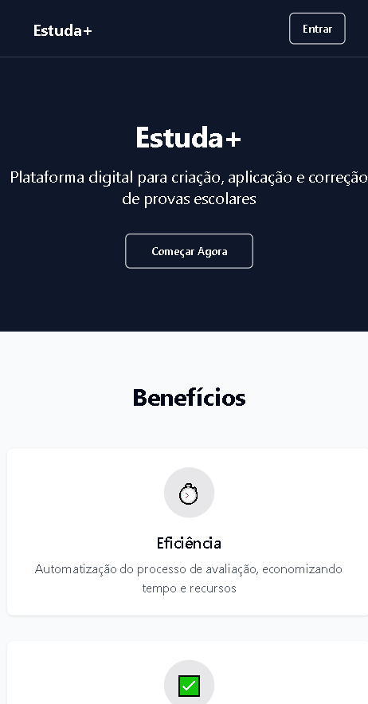
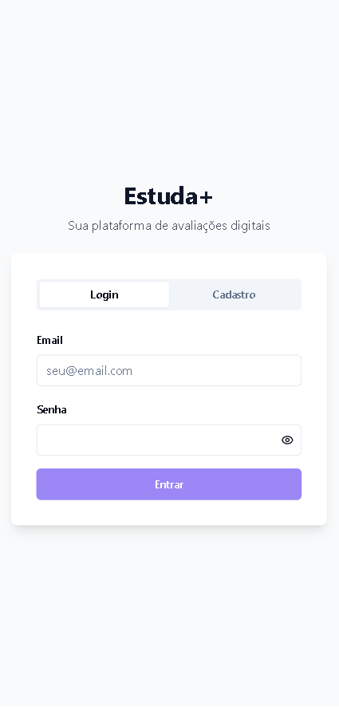
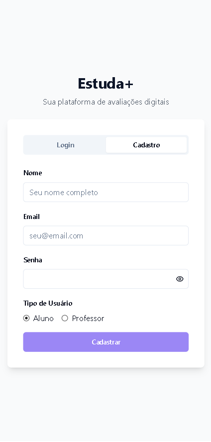

# 📚 Estuda Mais Assess

**Estuda Mais Assess** é uma aplicação voltada para o gerenciamento e acompanhamento de estudos. Com uma interface moderna e intuitiva, o projeto busca ajudar estudantes a organizarem seus cronogramas, tarefas e progresso de forma eficiente e visual.

---

## 🌐 Acesse Online

Você pode acessar a aplicação diretamente pela internet:

👉 [estuda-mais-assess.vercel.app](https://estuda-mais-acess.vercel.app)

---

## 🖼️ Imagens de Demonstração


### 📌 Tela Inicial



---

### 📝 Área de Login



---

### 📊 Área de Cadastro



---

### 📝 Área de Alunos


---

### 📝 Área do professor


---

## 🛠️ Tecnologias Utilizadas

Este projeto foi desenvolvido com as seguintes tecnologias:

- [TypeScript](https://www.typescriptlang.org/)
- [Tailwind CSS](https://tailwindcss.com/)
- [Vite](https://vitejs.dev/)
- [Supabase](https://supabase.com/)
- [Bun](https://bun.sh/) – runtime moderno para JavaScript/TypeScript

---

## 📁 Estrutura de Pastas

```bash
estuda-mais-assess/
├── public/                 # Arquivos públicos
│   └── images/             # Imagens da aplicação (prints, logos, etc.)
├── src/                    # Código-fonte principal
├── supabase/               # Configurações do Supabase
├── .gitignore
├── README.md
├── bun.lockb
├── components.json
├── eslint.config.js
├── index.html
├── package.json
├── postcss.config.js
├── tailwind.config.ts
├── tsconfig.app.json
├── tsconfig.json
├── tsconfig.node.json
└── vite.config.ts
```

---

🚀 Como Rodar Localmente

  Pré-requisitos
  Ter o Bun instalado

  Passo a passo

```bash
# 1. Clone o repositório
git clone https://github.com/Zhennyn/estuda-mais-assess.git

# 2. Acesse o diretório do projeto
cd estuda-mais-assess

# 3. Instale as dependências com o Bun
bun install

# 4. Rode o servidor de desenvolvimento
bun run dev

```

---

👤 Autores

  - Matheus Lima Menezes
  - Eduardo Lopes Ferreira Filho
  - Abraão Joventino Crispiano
  - André Luiz Fernandes
  - Lucas José Vicentini

👀 Observações

  - O projeto ainda está em desenvolvimento mas pela falta de tempo devido a bugs e sistemas caindo sofrerá uma leve pausa onde originalmente seria um app acabou virando um app.
  - Sendo um App nosso meio de emula-lo no computador seria utilizando expo porem ocorreram conflitos tanto do emulador quanto do código em si.
  - Atualizações futuras a serem feitas serão colocas a teste primeiro e depois serão lançadas.
  - Devido a pouca quantidade de tempo foi necessário o uso da platafroma lovable para correção de alguns bugs problematicos e para hospedagem utilizamos o vercel

