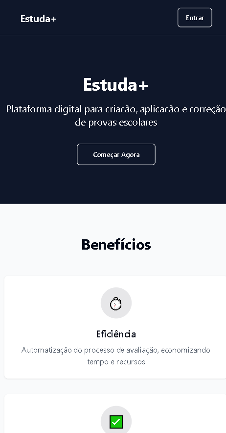
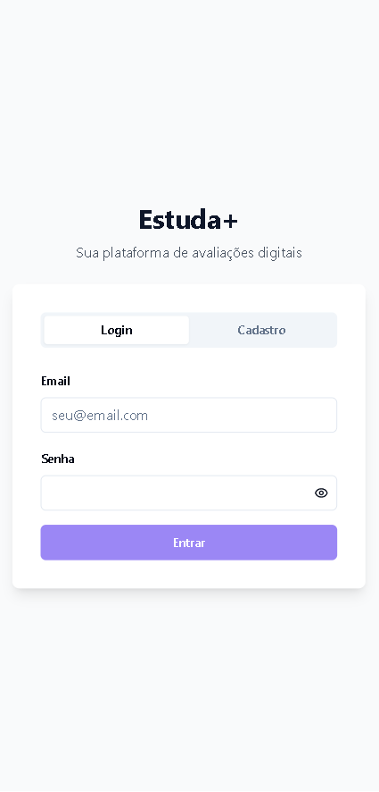
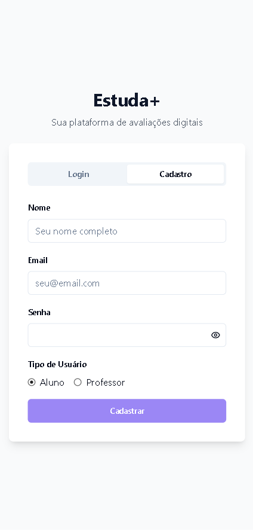
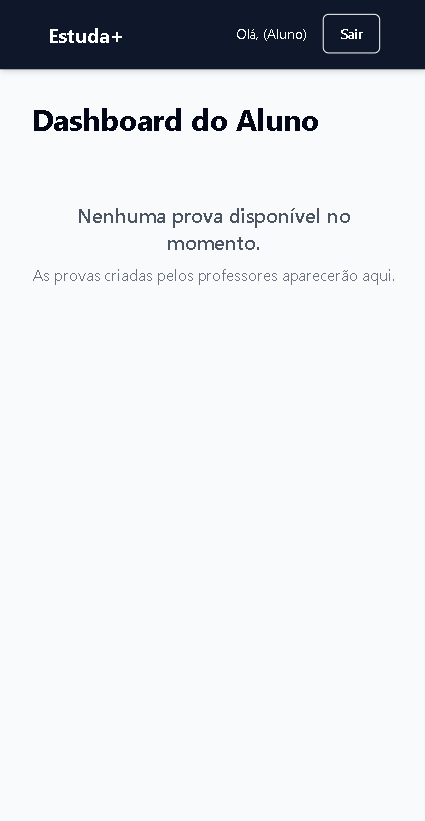
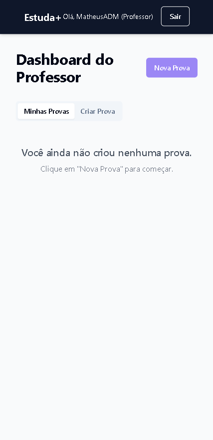

# 📚 Estuda Mais Assess

> Plataforma web de gerenciamento de avaliações educacionais — conectando professores e alunos em um ambiente moderno e intuitivo.



---

## ✨ Funcionalidades

- 🔐 **Autenticação segura** — login e cadastro com controle de acesso por perfil (aluno / professor)
- 👨‍🏫 **Painel do Professor** — criação, edição e gerenciamento completo de avaliações
- 🎓 **Painel do Aluno** — visualização e realização de provas de forma simples e responsiva
- 📝 **Criação de Questões** — formulário dinâmico para montar avaliações personalizadas
- 📊 **Resultados em tempo real** — alunos visualizam o desempenho logo após a submissão
- 📱 **PWA (Progressive Web App)** — instalável no dispositivo, experiência próxima a um app nativo
- ☁️ **Backend em nuvem** — dados persistidos e autenticação via Supabase (BaaS)

---

## 🛠️ Tecnologias Utilizadas


---

## 🚀 Como executar localmente

### Pré-requisitos

- [Bun](https://bun.sh/) instalado (`curl -fsSL https://bun.sh/install | bash`)
- Conta no [Supabase](https://supabase.com/) para configurar as variáveis de ambiente

### Passo a passo

```bash
# 1. Clone o repositório
git clone https://github.com/Zhennyn/estuda-mais-assess.git

# 2. Acesse o diretório do projeto
cd estuda-mais-assess

# 3. Instale as dependências
bun install

# 4. Configure as variáveis de ambiente
# Crie um arquivo .env na raiz com suas credenciais do Supabase:
# VITE_SUPABASE_URL=https://seu-projeto.supabase.co
# VITE_SUPABASE_ANON_KEY=sua-chave-publica

# 5. Inicie o servidor de desenvolvimento
bun run dev
```

> A aplicação estará disponível em `http://localhost:5173`

---

## 📸 Screenshots

### 🏠 Tela Inicial


### 🔑 Área de Login


### 📋 Cadastro


### 🎓 Painel do Aluno


### 👨‍🏫 Painel do Professor


---

## 🌐 Demonstração

🔗 **Acesse o projeto em produção:** [estuda-mais-acess.vercel.app](https://estuda-mais-acess.vercel.app)

> Hospedado na **Vercel** com deploy contínuo a partir do branch principal.

---

## 📌 Sobre o projeto

O **Estuda Mais Assess** é uma plataforma educacional full-stack desenvolvida como projeto acadêmico em 2024. A aplicação conecta professores e alunos por meio de um sistema de avaliações online, com autenticação por perfil, gerenciamento de provas e visualização de resultados.

**Por que esse projeto é relevante para recrutadores de TI?**

| Habilidade | Aplicação no projeto |
|---|---|
| 🗄️ Banco de Dados em Nuvem | Supabase (PostgreSQL gerenciado) |
| 🔐 Autenticação & Controle de Acesso | Perfis distintos: aluno e professor |
| ☁️ Deploy em Nuvem | Vercel + Supabase (arquitetura serverless) |
| 📊 Visualização de Dados | Recharts para exibição de resultados |
| 🧩 Componentização & Reutilização | shadcn/ui + Radix UI |
| 📱 PWA | Experiência mobile sem loja de apps |
| 🔄 Integração Frontend/Backend | React Query + Supabase REST API |

---

## 👥 Equipe

- Matheus Lima Menezes
- Eduardo Lopes Ferreira Filho
- Abraão Joventino Crispiano
- André Luiz Fernandes
- Lucas José Vicentini

---

<div align="center">

Feito com ❤️ por **Zhennyn** e equipe

⭐ Se este projeto te ajudou ou te inspirou, deixe uma estrela!  
🤝 Contribuições, sugestões e feedbacks são sempre bem-vindos — abra uma [issue](https://github.com/Zhennyn/estuda-mais-assess/issues) ou envie um PR!

</div>

